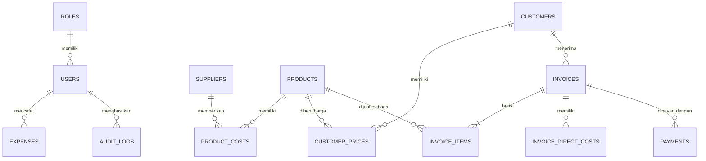

# Product Requirements Document — OceanSupply ERP

**Versi:** 1.0  
**Status:** Draft untuk MVP  
**Tanggal:** 30 Juli 2026  
**Pemilik produk:** Pemilik bisnis pemasok seafood  
**Platform:** Web responsif  
**Bahasa utama:** Bahasa Indonesia  
**Mata uang:** Rupiah Indonesia (IDR)

---

## 1. Ringkasan Produk

OceanSupply ERP adalah aplikasi web internal untuk bisnis pemasok seafood ke restoran. Sistem membantu pemilik bisnis mengelola harga beli dari nelayan atau supplier, harga jual khusus per restoran, pembuatan invoice PDF, pencatatan pembayaran, biaya internal seperti packaging dan ongkir, serta analisis omzet dan keuntungan.

Harga beli produk, biaya packaging, biaya pengiriman, HPP, dan laba merupakan data rahasia internal. Data tersebut tidak boleh muncul pada invoice PDF yang dikirim ke restoran.

---

## 2. Latar Belakang

Proses bisnis saat ini berpotensi dilakukan melalui spreadsheet, percakapan WhatsApp, catatan manual, dan pembuatan invoice terpisah. Hal tersebut menimbulkan beberapa masalah:

1. Harga beli seafood berubah-ubah dan sulit dilacak secara historis.
2. Harga jual dapat berbeda untuk setiap restoran.
3. Packaging dan ongkir sudah dimasukkan ke harga jual, tetapi biaya aktualnya perlu dicatat untuk menghitung keuntungan.
4. Invoice dibuat secara manual sehingga rawan salah hitung dan nomor duplikat.
5. Pemilik sulit mengetahui omzet, HPP, piutang, biaya langsung, dan laba per transaksi.
6. Perubahan harga master dapat mengubah hasil laporan lama apabila tidak menggunakan snapshot harga.
7. Informasi sensitif seperti harga beli berisiko ikut terbawa ke dokumen pelanggan.

---

## 3. Tujuan Produk

### 3.1 Tujuan utama

- Menyediakan satu sumber data untuk produk, supplier, restoran, harga, invoice, pembayaran, dan biaya.
- Menghasilkan invoice PDF yang cepat, konsisten, dan aman untuk pelanggan.
- Menghitung laba setiap transaksi setelah harga beli, packaging, ongkir, dan biaya langsung lainnya.
- Menampilkan dashboard keuangan yang mudah dipahami.
- Menyimpan histori harga agar laporan transaksi lama tidak berubah.
- Membatasi akses ke data sensitif berdasarkan role.

### 3.2 Sasaran keberhasilan

- Waktu pembuatan invoice maksimal 3 menit.
- Tidak ada harga beli atau biaya internal yang tampil pada invoice pelanggan.
- Seluruh invoice memiliki nomor unik.
- Nilai laba transaksi dapat ditelusuri ke item produk dan biaya internal.
- Pemilik dapat melihat omzet, piutang, HPP, biaya internal, dan laba dalam satu dashboard.
- Minimal 95% transaksi penjualan dicatat melalui sistem setelah masa adopsi.

---

## 4. Ruang Lingkup

## 4.1 Fitur MVP

1. Autentikasi pengguna.
2. Role dan permission.
3. Dashboard bisnis.
4. Master produk.
5. Master supplier.
6. Master restoran.
7. Riwayat harga beli.
8. Harga jual default dan harga jual khusus restoran.
9. Pembuatan invoice.
10. Snapshot harga beli dan harga jual.
11. Biaya internal per invoice.
12. Generate invoice PDF.
13. Pencatatan pembayaran.
14. Status invoice dan piutang.
15. Pencatatan pengeluaran operasional.
16. Laporan penjualan dan keuntungan.
17. Audit log untuk aktivitas penting.

## 4.2 Di luar MVP

- Manajemen stok per batch.
- Purchase order.
- FIFO atau weighted average untuk HPP.
- Integrasi otomatis WhatsApp Business API.
- Integrasi akuntansi pihak ketiga.
- Pelacakan kendaraan dan kurir.
- Rekonsiliasi bank otomatis.
- Multi-company.
- Multi-currency.
- Portal pelanggan.
- Aplikasi mobile native.

---

## 5. Persona Pengguna

### 5.1 Owner

Kebutuhan:

- Melihat seluruh performa bisnis.
- Melihat harga beli, HPP, biaya internal, dan laba.
- Mengatur harga jual.
- Melihat piutang dan pembayaran.
- Mengelola pengguna dan hak akses.

### 5.2 Finance/Admin

Kebutuhan:

- Membuat dan menerbitkan invoice.
- Mencatat pembayaran.
- Memasukkan biaya packaging, ongkir, dan biaya internal lain.
- Membuat laporan.
- Melihat harga beli apabila diberikan izin.

### 5.3 Staff Operasional

Kebutuhan:

- Membuat draft invoice.
- Memilih produk dan restoran.
- Memasukkan jumlah barang.
- Memasukkan biaya operasional tertentu.
- Tidak melihat harga beli atau laba apabila tidak memiliki izin.

---

## 6. Role dan Permission

| Fitur | Owner | Finance | Staff |
|---|---:|---:|---:|
| Melihat dashboard umum | Ya | Ya | Terbatas |
| Melihat harga beli | Ya | Ya | Tidak |
| Melihat laba | Ya | Ya | Tidak |
| Mengelola produk | Ya | Ya | Terbatas |
| Mengelola harga beli | Ya | Ya | Tidak |
| Mengelola harga jual | Ya | Ya | Tidak |
| Membuat draft invoice | Ya | Ya | Ya |
| Menerbitkan invoice | Ya | Ya | Opsional |
| Membatalkan invoice | Ya | Ya | Tidak |
| Mencatat pembayaran | Ya | Ya | Tidak |
| Mengelola pengguna | Ya | Tidak | Tidak |
| Melihat audit log | Ya | Terbatas | Tidak |

Permission harus diterapkan di server, bukan hanya menyembunyikan elemen antarmuka.

---

## 7. Istilah Bisnis

### 7.1 Pendapatan

Total nilai barang yang ditagihkan kepada restoran, dikurangi diskon. Packaging dan ongkir tidak ditampilkan terpisah karena sudah termasuk dalam harga jual barang.

### 7.2 HPP produk

Total harga beli produk yang terjual berdasarkan snapshot harga beli pada saat invoice diterbitkan.

### 7.3 Laba produk

```text
Laba Produk = Pendapatan Produk - HPP Produk
```

### 7.4 Biaya langsung

Biaya yang terkait langsung dengan transaksi, antara lain:

- Packaging.
- Es.
- Plastik.
- Styrofoam.
- Ongkir.
- Bensin.
- Tol.
- Parkir.
- Upah kurir.
- Penyusutan produk.
- Biaya langsung lainnya.

### 7.5 Laba transaksi

```text
Laba Transaksi =
Pendapatan setelah diskon
- HPP produk
- seluruh biaya langsung
```

### 7.6 Margin transaksi

```text
Margin Transaksi =
Laba Transaksi / Pendapatan setelah diskon × 100%
```

### 7.7 Laba bersih

Laba transaksi dikurangi pengeluaran operasional seperti gaji, sewa, listrik, langganan, dan biaya administrasi.

---

## 8. Prinsip Data Utama

### 8.1 Snapshot harga

Saat invoice diterbitkan, sistem wajib menyimpan:

- Harga jual per item.
- Harga beli per item.
- Nama produk.
- Satuan.
- Jumlah.
- Subtotal.
- Total HPP item.

Perubahan harga master setelah invoice diterbitkan tidak boleh mengubah invoice lama.

### 8.2 Data publik dan internal

Data publik invoice:

- Nomor invoice.
- Restoran.
- Tanggal.
- Produk.
- Kuantitas.
- Satuan.
- Harga jual.
- Diskon.
- Total.
- Informasi pembayaran.

Data internal:

- Harga beli.
- HPP.
- Biaya packaging.
- Ongkir.
- Biaya langsung lainnya.
- Laba produk.
- Laba transaksi.
- Margin.

### 8.3 Invoice yang diterbitkan tidak diedit bebas

- Invoice berstatus `DRAFT` dapat diedit.
- Invoice berstatus `ISSUED` tidak boleh mengubah nilai historis secara langsung.
- Koreksi dilakukan melalui pembatalan, revisi terkontrol, atau invoice pengganti.
- Semua perubahan penting dicatat di audit log.

---

## 9. Alur Pengguna Utama

## 9.1 Membuat invoice

1. Pengguna membuka menu Invoice.
2. Pengguna menekan `Buat Invoice`.
3. Pengguna memilih restoran.
4. Sistem mengisi alamat dan termin pembayaran.
5. Pengguna menambahkan produk.
6. Sistem mengambil harga jual khusus restoran atau harga jual default.
7. Pengguna memasukkan kuantitas.
8. Sistem mengambil harga beli aktif secara internal.
9. Pengguna memasukkan biaya internal transaksi.
10. Sistem menghitung pendapatan, HPP, laba produk, biaya langsung, laba transaksi, dan margin.
11. Pengguna menyimpan sebagai draft atau menerbitkan invoice.
12. Sistem menghasilkan nomor invoice unik.
13. Sistem menyimpan snapshot transaksi.
14. Sistem menyediakan preview dan PDF pelanggan.

## 9.2 Mencatat pembayaran

1. Pengguna membuka detail invoice.
2. Pengguna memilih `Catat Pembayaran`.
3. Pengguna memasukkan tanggal, nominal, metode, dan nomor referensi.
4. Sistem memperbarui total pembayaran.
5. Sistem mengubah status:
   - `ISSUED` jika belum dibayar.
   - `PARTIALLY_PAID` jika dibayar sebagian.
   - `PAID` jika lunas.
   - `OVERDUE` jika melewati jatuh tempo dan belum lunas.

## 9.3 Memperbarui harga beli

1. Pengguna membuka produk.
2. Pengguna memilih `Tambah Harga Beli`.
3. Pengguna memilih supplier dan tanggal berlaku.
4. Pengguna memasukkan harga baru.
5. Sistem menutup periode harga sebelumnya apabila diperlukan.
6. Invoice lama tidak berubah.

---

## 10. Kebutuhan Fungsional

## FR-01 Autentikasi

- Pengguna dapat login menggunakan email dan password.
- Sistem dapat menonaktifkan akun.
- Session harus berakhir setelah masa tertentu.
- Password disimpan dalam bentuk hash.
- Akses halaman dilindungi berdasarkan role.

## FR-02 Dashboard

Dashboard harus menyediakan filter tanggal dan menampilkan:

- Pesanan hari ini.
- Pesanan minggu ini.
- Pendapatan bulan ini.
- Laba transaksi bulan ini.
- Grafik penjualan harian.
- Grafik laba dan margin.
- Invoice belum lunas.
- Pembayaran masuk.
- Biaya packaging.
- Biaya ongkir.
- Biaya internal lainnya.
- Produk paling banyak terjual.
- Restoran dengan nilai transaksi terbesar.

Kartu dashboard harus dapat diklik untuk membuka laporan terkait.

## FR-03 Produk

Data produk:

- SKU unik.
- Nama produk.
- Kategori.
- Satuan default.
- Status aktif/nonaktif.
- Deskripsi opsional.
- Harga jual default opsional.

Pengguna dapat:

- Menambah.
- Mengubah.
- Menonaktifkan.
- Mencari.
- Memfilter kategori dan status.

Produk yang pernah dipakai pada invoice tidak boleh dihapus permanen.

## FR-04 Supplier

Data supplier:

- Nama.
- Kontak.
- Telepon.
- Email opsional.
- Alamat.
- Status.

Supplier dapat memiliki banyak riwayat harga produk.

## FR-05 Restoran

Data restoran:

- Nama restoran.
- PIC.
- Telepon.
- Email.
- Alamat penagihan.
- Alamat pengiriman.
- Termin pembayaran.
- Status.
- Catatan.

Restoran dapat memiliki harga khusus untuk setiap produk.

## FR-06 Riwayat harga beli

- Harga beli terkait produk dan supplier.
- Memiliki tanggal mulai berlaku.
- Dapat memiliki tanggal selesai berlaku.
- Tidak boleh terdapat dua harga aktif yang ambigu untuk produk dan supplier yang sama.
- Sistem menampilkan histori perubahan.
- Perubahan dicatat di audit log.

## FR-07 Harga jual

Sistem mendukung:

1. Harga jual default produk.
2. Harga jual khusus per restoran.
3. Harga manual pada draft invoice apabila pengguna memiliki izin.

Prioritas harga:

```text
Harga khusus restoran
→ harga default produk
→ input manual
```

## FR-08 Invoice

Data invoice:

- Nomor unik.
- Restoran.
- Tanggal invoice.
- Jatuh tempo.
- Status.
- Item.
- Diskon.
- Total.
- Catatan.
- Informasi pembayaran.
- Biaya internal.
- Nilai laba internal.

Status invoice:

- `DRAFT`
- `ISSUED`
- `PARTIALLY_PAID`
- `PAID`
- `OVERDUE`
- `VOID`

## FR-09 Item invoice

Setiap item memiliki:

- Produk.
- Deskripsi snapshot.
- Kuantitas.
- Satuan.
- Harga jual snapshot.
- Harga beli snapshot.
- Subtotal.
- Total HPP.
- Laba item.

Kuantitas harus lebih besar dari nol.

## FR-10 Biaya internal invoice

Biaya internal disimpan terpisah dari item invoice.

Kategori awal:

- `PACKAGING`
- `ICE`
- `SHIPPING`
- `FUEL`
- `TOLL`
- `PARKING`
- `COURIER`
- `PRODUCT_LOSS`
- `OTHER`

Setiap biaya memiliki:

- Kategori.
- Nama biaya.
- Jumlah.
- Catatan opsional.

Biaya internal tidak boleh muncul pada PDF pelanggan.

## FR-11 Generate PDF

PDF harus menampilkan:

- Logo dan informasi perusahaan.
- Nomor invoice.
- Tanggal invoice.
- Jatuh tempo.
- Data restoran.
- Tabel produk.
- Kuantitas dan satuan.
- Harga jual.
- Subtotal.
- Diskon.
- Total.
- Catatan.
- Informasi rekening/pembayaran.

PDF tidak boleh menampilkan:

- Harga beli.
- HPP.
- Packaging.
- Ongkir.
- Biaya langsung lain.
- Laba.
- Margin.
- Supplier.

## FR-12 Pembayaran

- Mendukung pembayaran penuh dan sebagian.
- Menyimpan tanggal, nominal, metode, dan referensi.
- Total pembayaran tidak boleh negatif.
- Kelebihan pembayaran harus diberi peringatan.
- Status invoice diperbarui otomatis.

## FR-13 Pengeluaran operasional

Pengeluaran di luar biaya langsung invoice dapat dicatat dengan:

- Kategori.
- Deskripsi.
- Nominal.
- Tanggal.
- Pengguna pencatat.
- Bukti opsional pada versi lanjut.

## FR-14 Laporan

Laporan minimum:

- Penjualan per periode.
- Laba transaksi per periode.
- Penjualan per restoran.
- Penjualan per produk.
- HPP per produk.
- Biaya packaging.
- Biaya pengiriman.
- Piutang.
- Pembayaran masuk.
- Pengeluaran operasional.
- Estimasi laba bersih.

Filter:

- Rentang tanggal.
- Restoran.
- Produk.
- Supplier.
- Status invoice.
- Status pembayaran.

## FR-15 Audit log

Aktivitas yang dicatat:

- Login penting atau gagal berulang.
- Perubahan harga beli.
- Perubahan harga jual.
- Pembuatan invoice.
- Penerbitan invoice.
- Pembatalan invoice.
- Pencatatan dan penghapusan pembayaran.
- Perubahan role.
- Perubahan biaya internal.

---

## 11. Aturan Bisnis

1. Nomor invoice harus unik.
2. Nomor invoice dihasilkan saat invoice diterbitkan, bukan saat draft dibuat.
3. Invoice draft dapat disimpan tanpa PDF final.
4. Harga beli dan jual wajib disimpan sebagai snapshot saat diterbitkan.
5. Biaya packaging dan ongkir tidak ditampilkan kepada pelanggan.
6. Total invoice hanya berasal dari item penjualan, diskon, dan komponen pelanggan yang memang diizinkan.
7. Pajak tidak otomatis dianggap pendapatan perusahaan.
8. Produk nonaktif tidak dapat ditambahkan ke invoice baru.
9. Restoran nonaktif tidak dapat dipilih untuk invoice baru.
10. Invoice yang telah dibayar tidak boleh dibatalkan tanpa izin Owner.
11. Semua nilai uang menggunakan tipe desimal presisi.
12. Semua waktu disimpan di database dalam UTC dan ditampilkan dalam zona waktu bisnis.
13. Perubahan harga master tidak memengaruhi laporan historis.
14. Draft harus menghitung ulang laba setiap kali item atau biaya berubah.
15. Nilai internal tidak boleh muncul dalam API pelanggan atau PDF.

---

## 12. Nomor Invoice

Format awal:

```text
INV/YYYY/MM/NNNN
```

Contoh:

```text
INV/2026/07/0001
```

Ketentuan:

- Urutan dimulai ulang setiap bulan atau tahun sesuai keputusan bisnis.
- Pembuatan nomor dilakukan dalam transaksi database.
- Tidak menggunakan `jumlah invoice + 1`.
- Invoice batal tetap mempertahankan nomor untuk audit.

---

## 13. Kebutuhan Nonfungsional

## NFR-01 Keamanan

- HTTPS wajib.
- Password menggunakan hashing yang kuat.
- Validasi role dilakukan di server.
- Endpoint PDF memerlukan autentikasi atau token aman.
- Data internal tidak boleh masuk ke payload publik.
- Proteksi CSRF apabila relevan.
- Rate limiting pada login.
- Audit aktivitas sensitif.

## NFR-02 Performa

- Halaman dashboard awal dimuat kurang dari 3 detik pada koneksi normal.
- Pencarian tabel memberi respons kurang dari 1 detik untuk data MVP.
- Generate PDF maksimal 5 detik untuk invoice normal.
- Query dashboard menggunakan agregasi dan indeks yang sesuai.

## NFR-03 Reliabilitas

- Pembuatan invoice menggunakan transaksi database.
- Sistem melakukan backup berkala.
- Kesalahan generate PDF tidak boleh menghapus invoice.
- Pembayaran dan invoice memiliki integritas referensial.

## NFR-04 Responsif

- Desktop menjadi platform utama.
- Tablet didukung penuh.
- Mobile mendukung dashboard ringkas, pencarian invoice, dan melihat detail dasar.
- Form invoice kompleks dapat dioptimalkan untuk tablet/desktop.

## NFR-05 Aksesibilitas

- Kontras teks memenuhi WCAG AA.
- Semua input memiliki label.
- Navigasi keyboard tersedia.
- Status tidak hanya dibedakan berdasarkan warna.
- Tabel memiliki heading yang jelas.

## NFR-06 Observability

- Error server dicatat.
- Aktivitas kritis memiliki log.
- Sistem menampilkan error yang dapat dipahami pengguna.
- Informasi sensitif tidak ditulis ke log aplikasi.

---

## 14. Model Data Inti



---

## 15. Struktur Entitas Ringkas

### roles

- id
- name

### users

- id
- role_id
- name
- email
- password_hash
- status
- created_at
- updated_at

### products

- id
- sku
- name
- category
- default_unit
- default_selling_price
- status
- created_at
- updated_at

### suppliers

- id
- name
- contact_name
- phone
- email
- address
- status

### customers

- id
- name
- contact_name
- phone
- email
- billing_address
- shipping_address
- payment_term_days
- status

### product_costs

- id
- product_id
- supplier_id
- unit_cost
- effective_at
- ended_at
- created_by
- created_at

### customer_prices

- id
- customer_id
- product_id
- selling_price
- effective_at
- ended_at
- created_at

### invoices

- id
- invoice_number
- customer_id
- issue_date
- due_date
- status
- subtotal
- discount
- total
- total_product_cost
- total_direct_cost
- product_profit
- transaction_profit
- transaction_margin
- notes
- created_by
- created_at
- updated_at

### invoice_items

- id
- invoice_id
- product_id
- description_snapshot
- unit
- quantity
- selling_price_snapshot
- purchase_price_snapshot
- subtotal
- total_purchase_cost
- product_profit

### invoice_direct_costs

- id
- invoice_id
- category
- name
- amount
- notes

### payments

- id
- invoice_id
- payment_date
- amount
- method
- reference_number
- notes
- created_by

### expenses

- id
- user_id
- category
- description
- amount
- expense_date
- created_at

### audit_logs

- id
- user_id
- entity_name
- entity_id
- action
- before_data
- after_data
- created_at

---

## 16. Acceptance Criteria Utama

### Invoice

- Pengguna dapat membuat invoice dengan satu atau lebih produk.
- Harga jual otomatis mengikuti restoran yang dipilih.
- Harga beli diambil secara internal.
- Pengguna dapat menambahkan packaging dan ongkir sebagai biaya internal.
- Sistem menampilkan estimasi laba transaksi sebelum invoice diterbitkan.
- PDF hanya menampilkan data pelanggan.
- Invoice lama tidak berubah setelah harga master diperbarui.

### Dashboard

- Nilai omzet sesuai total invoice dalam periode.
- HPP sesuai snapshot item.
- Biaya internal sesuai biaya invoice.
- Laba transaksi sesuai rumus.
- Piutang sesuai invoice dikurangi pembayaran.
- Filter periode memengaruhi seluruh kartu dan grafik.

### Permission

- Staff tanpa izin tidak dapat memperoleh harga beli melalui UI maupun API.
- Finance dapat membuat invoice dan pembayaran.
- Owner dapat melihat seluruh data dan audit log.

---

## 17. Metrik Produk

- Jumlah invoice yang dibuat per minggu.
- Rata-rata waktu pembuatan invoice.
- Persentase invoice yang dibuat melalui sistem.
- Persentase invoice lunas tepat waktu.
- Nilai piutang berjalan.
- Margin transaksi rata-rata.
- Persentase transaksi dengan margin di bawah ambang batas.
- Frekuensi koreksi atau pembatalan invoice.
- Jumlah error generate PDF.

---

## 18. Tahapan Pengembangan

### Tahap 1 — Fondasi

- Setup aplikasi.
- Database.
- Autentikasi.
- Role dan permission.
- Produk.
- Supplier.
- Restoran.

### Tahap 2 — Pricing dan Invoice

- Riwayat harga beli.
- Harga jual per restoran.
- Draft invoice.
- Kalkulasi.
- Snapshot.
- Nomor invoice.
- Generate PDF.

### Tahap 3 — Keuangan

- Biaya internal.
- Pembayaran.
- Piutang.
- Pengeluaran operasional.
- Dashboard.
- Laporan.

### Tahap 4 — Hardening

- Audit log.
- Pengujian permission.
- Backup.
- Monitoring.
- Optimasi performa.
- Uji penerimaan pengguna.

---

## 19. Risiko dan Mitigasi

| Risiko | Dampak | Mitigasi |
|---|---|---|
| Harga beli salah | Laporan laba salah | Snapshot, validasi, audit log |
| Data internal bocor ke PDF | Kerahasiaan bisnis terganggu | DTO publik khusus dan pengujian otomatis |
| Nomor invoice duplikat | Masalah administrasi | Sequence/counter dalam transaksi |
| Biaya ongkir tidak dicatat | Margin terlalu tinggi secara semu | Field biaya internal wajib sebelum finalisasi |
| Staff memiliki akses berlebih | Kebocoran data | RBAC di server |
| Invoice lama berubah | Laporan historis tidak valid | Snapshot dan immutable issued invoice |
| Pembayaran tidak cocok | Piutang salah | Validasi nominal dan rekonsiliasi manual |
| Dashboard lambat | Pengguna enggan menggunakan sistem | Indeks, agregasi, caching terbatas |

---

## 20. Pertanyaan Terbuka

1. Apakah nomor invoice dimulai ulang per bulan atau per tahun?
2. Apakah perusahaan menggunakan pajak pada invoice?
3. Apakah satu invoice dapat memiliki beberapa alamat pengiriman?
4. Apakah harga beli dipilih per supplier atau otomatis mengambil harga terbaru?
5. Apakah biaya internal wajib diisi sebelum invoice diterbitkan?
6. Apakah staff boleh melihat estimasi laba atau hanya Owner dan Finance?
7. Apakah PDF perlu tanda tangan dan stempel digital?
8. Apakah pembayaran dapat diterima melalui lebih dari satu metode?
9. Apakah invoice dapat dikirim langsung melalui email?
10. Apakah laporan perlu ekspor CSV atau Excel pada MVP?

---

## 21. Definisi Selesai untuk MVP

MVP dinyatakan selesai apabila:

- Role Owner, Finance, dan Staff tersedia.
- Master produk, supplier, dan restoran berjalan.
- Harga beli historis dan harga jual per restoran berjalan.
- Invoice dapat dibuat, diterbitkan, dan diunduh sebagai PDF.
- Harga beli serta biaya internal tidak muncul pada PDF.
- Pembayaran penuh dan sebagian dapat dicatat.
- Dashboard menampilkan omzet, HPP, biaya internal, piutang, laba, dan margin.
- Laporan dasar dapat difilter berdasarkan periode.
- Aktivitas sensitif tercatat.
- Pengujian permission dan kalkulasi utama lulus.
