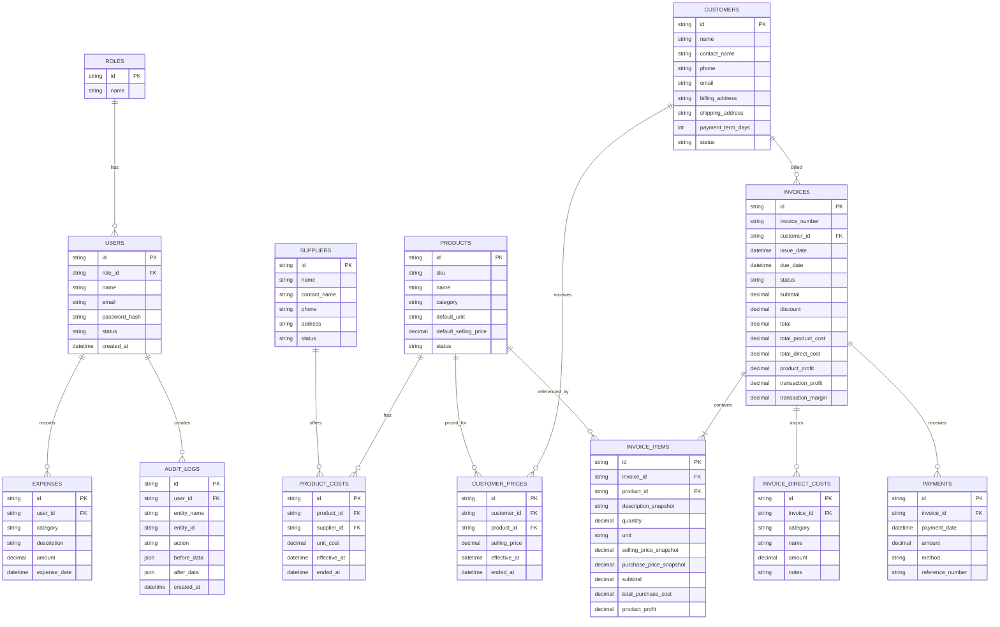

# Design Specification — OceanSupply ERP

**Versi:** 1.0  
**Status:** Draft desain MVP  
**Tanggal:** 30 Juli 2026  
**Arah visual:** Monokrom premium, modern SaaS, bersih, profesional  
**Referensi:** Dashboard ERP dengan sidebar gelap, konten putih, kartu membulat, dan visualisasi data minimal

---

## 1. Tujuan Desain

Desain OceanSupply ERP harus membuat proses operasional yang kompleks terasa sederhana. Pengguna harus dapat memahami kondisi bisnis, membuat invoice, dan mengecek laba tanpa harus membaca terlalu banyak angka sekaligus.

Prioritas desain:

1. Kejelasan data.
2. Kecepatan input.
3. Pemisahan data publik dan data rahasia.
4. Konsistensi visual.
5. Responsif pada desktop, tablet, dan mobile.
6. Minim kesalahan pengguna.

---

## 2. Prinsip UX

### 2.1 Informasi penting terlihat lebih dulu

Dashboard menampilkan:

- Pesanan.
- Pendapatan.
- Laba transaksi.
- Piutang.
- Pembayaran.
- Biaya internal.

### 2.2 Data sensitif diberi konteks

Harga beli dan laba diberi label `Internal`. Pengguna tanpa izin tidak melihat ruang kosong atau placeholder sensitif; komponen tersebut tidak dikirim dari server.

### 2.3 Input dengan bantuan sistem

- Harga jual terisi otomatis.
- Harga beli diambil otomatis.
- Termin pembayaran mengikuti restoran.
- Subtotal dan laba dihitung langsung.
- Kesalahan ditampilkan dekat field terkait.

### 2.4 Progressive disclosure

Informasi yang jarang dipakai ditempatkan pada panel detail atau accordion. Form invoice utama tetap ringkas.

### 2.5 Status harus mudah dikenali

Gunakan badge dengan ikon dan teks:

- Draft.
- Diterbitkan.
- Dibayar sebagian.
- Lunas.
- Jatuh tempo.
- Dibatalkan.

---

## 3. Arsitektur Informasi

```text
OceanSupply ERP
├── Dashboard
├── Produk
│   ├── Daftar Produk
│   ├── Detail Produk
│   └── Riwayat Harga Beli
├── Harga
│   ├── Harga Beli
│   └── Harga Jual Restoran
├── Invoice
│   ├── Daftar Invoice
│   ├── Buat Invoice
│   └── Detail Invoice
├── Pembayaran
├── Restoran
├── Supplier
├── Pengeluaran
├── Laporan
│   ├── Penjualan
│   ├── Laba
│   ├── Piutang
│   └── Biaya Internal
└── Pengaturan
    ├── Profil Bisnis
    ├── Pengguna dan Role
    ├── Nomor Invoice
    └── Audit Log
```

---

## 4. Sitemap dan Route

```text
/login

/dashboard

/products
/products/new
/products/[id]
/products/[id]/costs

/pricing/purchase
/pricing/selling

/customers
/customers/new
/customers/[id]

/suppliers
/suppliers/new
/suppliers/[id]

/invoices
/invoices/new
/invoices/[id]
/invoices/[id]/preview

/payments
/expenses

/reports/sales
/reports/profit
/reports/receivables
/reports/internal-costs

/settings/company
/settings/users
/settings/invoice
/settings/audit-logs
```

---

## 5. Layout Utama

### 5.1 Desktop

- Sidebar kiri: 256 px.
- Topbar: 64 px.
- Area konten: fleksibel.
- Padding konten: 24–32 px.
- Lebar maksimum konten: 1600 px.
- Grid dashboard: 12 kolom.
- Jarak antarkartu: 16–20 px.

Struktur:

```text
┌──────────────┬─────────────────────────────────────────┐
│ Sidebar      │ Topbar                                  │
│              ├─────────────────────────────────────────┤
│              │ Breadcrumb / Title / Actions            │
│              ├─────────────────────────────────────────┤
│              │ Content                                 │
│              │                                         │
└──────────────┴─────────────────────────────────────────┘
```

### 5.2 Tablet

- Sidebar dapat diperkecil menjadi ikon.
- Form invoice menggunakan layout dua kolom.
- Kartu dashboard menggunakan dua kolom.

### 5.3 Mobile

- Sidebar menjadi drawer.
- Navigasi utama dapat menggunakan bottom navigation:
  - Dashboard.
  - Invoice.
  - Restoran.
  - Laporan.
  - Lainnya.
- Kartu tampil satu kolom.
- Tabel berubah menjadi kartu atau dapat digeser horizontal.
- Pembuatan invoice kompleks tetap disarankan di tablet/desktop.

---

## 6. Gaya Visual

### 6.1 Karakter

- Premium.
- Modern.
- Tenang.
- Bersih.
- Monokrom.
- Berorientasi data.

### 6.2 Warna

```css
:root {
  --background: #f5f5f4;
  --surface: #ffffff;
  --surface-subtle: #fafafa;

  --sidebar: #151515;
  --sidebar-hover: #242424;
  --sidebar-active: #303030;

  --text-primary: #171717;
  --text-secondary: #666666;
  --text-muted: #999999;
  --text-inverse: #ffffff;

  --border: #e5e5e5;
  --border-strong: #d4d4d4;

  --success: #15803d;
  --success-bg: #ecfdf3;

  --warning: #b45309;
  --warning-bg: #fff7ed;

  --danger: #b91c1c;
  --danger-bg: #fef2f2;

  --info: #1d4ed8;
  --info-bg: #eff6ff;
}
```

Warna hijau dan merah hanya digunakan untuk status, tren, dan peringatan. Jangan menjadikan dashboard terlalu berwarna.

### 6.3 Tipografi

Rekomendasi:

- `Inter`
- `Geist`
- `Plus Jakarta Sans`

Skala:

| Token | Ukuran | Berat |
|---|---:|---:|
| Display | 40 px | 700 |
| H1 | 32 px | 700 |
| H2 | 24 px | 650 |
| H3 | 18 px | 600 |
| Body | 14–16 px | 400 |
| Label | 13–14 px | 500 |
| Caption | 12 px | 400 |
| Metric | 28–36 px | 700 |

### 6.4 Radius

```css
--radius-sm: 8px;
--radius-md: 12px;
--radius-lg: 16px;
--radius-xl: 20px;
```

### 6.5 Shadow

```css
--shadow-card:
  0 1px 2px rgba(0, 0, 0, 0.04),
  0 8px 24px rgba(0, 0, 0, 0.04);
```

---

## 7. Komponen Global

## 7.1 Sidebar

Isi:

- Logo OceanSupply ERP.
- Menu utama.
- Divider.
- Menu pengaturan.
- Profil pengguna di bagian bawah.

State:

- Default.
- Hover.
- Active.
- Collapsed.

Sidebar aktif menggunakan latar sedikit lebih terang dan teks putih.

## 7.2 Topbar

Isi:

- Breadcrumb.
- Pemilih periode global.
- Tombol notifikasi opsional.
- Profil pengguna.
- Dropdown akun.

## 7.3 Page Header

Struktur:

```text
Judul Halaman
Deskripsi singkat

[Filter] [Aksi Sekunder] [Aksi Utama]
```

Contoh:

```text
Invoice
Kelola invoice dan pembayaran restoran

[Filter Status] [Ekspor] [+ Buat Invoice]
```

## 7.4 Card

Variasi:

- Metric card.
- Chart card.
- Table card.
- Form card.
- Summary card.
- Alert card.

Card standar:

- Latar putih.
- Border tipis.
- Radius 16 px.
- Padding 20–24 px.
- Shadow sangat halus.

## 7.5 Button

Variasi:

- Primary: hitam.
- Secondary: putih dengan border.
- Ghost.
- Danger.
- Icon button.

Ukuran minimum tinggi tombol: 40 px.

## 7.6 Form

Komponen:

- Text input.
- Currency input.
- Number input.
- Date picker.
- Select.
- Combobox dengan pencarian.
- Textarea.
- Switch.
- Radio.
- Checkbox.

Aturan:

- Label selalu terlihat.
- Placeholder bukan pengganti label.
- Prefix `Rp` untuk uang.
- Pemisah ribuan otomatis.
- Pesan error di bawah field.
- Field internal diberi ikon kunci atau label `Internal`.

## 7.7 Table

Fitur:

- Search.
- Filter.
- Sort.
- Pagination.
- Column visibility.
- Sticky header.
- Empty state.
- Row action menu.

Angka rata kanan. Nama dan deskripsi rata kiri.

## 7.8 Badge

Contoh:

```text
Draft
Diterbitkan
Dibayar Sebagian
Lunas
Jatuh Tempo
Dibatalkan
Internal
```

---

## 8. Dashboard

## 8.1 Struktur desktop

```text
Baris 1
┌────────────┬────────────┬────────────┬────────────┐
│ Order Hari │ Order Pekan│ Pendapatan │ Laba       │
└────────────┴────────────┴────────────┴────────────┘

Baris 2
┌───────────────────────────┬────────────────────────┐
│ Grafik Penjualan Harian   │ Grafik Laba & Margin   │
└───────────────────────────┴────────────────────────┘

Baris 3
┌──────────────────────┬────────────────┬─────────────┐
│ Pricing Produk       │ Invoice Cepat │ Biaya Internal│
└──────────────────────┴────────────────┴─────────────┘

Baris 4
┌───────────────────────────┬────────────────────────┐
│ Invoice Belum Lunas       │ Pembayaran Masuk       │
└───────────────────────────┴────────────────────────┘
```

## 8.2 Kartu metrik

### Pesanan Hari Ini

- Nilai total invoice hari ini.
- Perbandingan dengan kemarin.
- Klik membuka daftar invoice terfilter.

### Pendapatan Bulan Ini

- Total invoice issued sebelum pajak.
- Perbandingan dengan bulan sebelumnya.

### Laba Transaksi

- Pendapatan dikurangi HPP dan biaya langsung.
- Tampilkan margin.

### Piutang

- Nilai invoice belum lunas.
- Jumlah invoice overdue.

## 8.3 Grafik

### Penjualan Harian

- Bar chart.
- Tooltip berisi tanggal dan total.
- Toggle hari/minggu/bulan.

### Laba dan Margin

- Line chart.
- Dapat menampilkan laba atau margin.
- Tooltip berisi tanggal, laba, dan margin.

### Biaya Internal

Daftar:

- Packaging.
- Ongkir.
- Es.
- Bensin.
- Tol.
- Lainnya.

Klik item membuka laporan biaya terfilter.

---

## 9. Halaman Produk

## 9.1 Daftar produk

Kolom:

- SKU.
- Nama.
- Kategori.
- Satuan.
- Harga beli aktif.
- Harga jual default.
- Margin estimasi.
- Status.
- Aksi.

Harga beli hanya terlihat oleh role yang berhak.

## 9.2 Detail produk

Tab:

1. Ringkasan.
2. Riwayat harga beli.
3. Harga restoran.
4. Riwayat penjualan.
5. Audit.

Ringkasan menampilkan:

- Harga beli aktif.
- Harga jual default.
- Margin.
- Supplier.
- Penjualan bulan ini.
- Tren harga.

---

## 10. Halaman Harga

## 10.1 Harga beli

Tampilan tabel:

- Produk.
- Supplier.
- Harga beli.
- Tanggal berlaku.
- Tanggal selesai.
- Status.
- Diubah oleh.

Aksi:

- Tambah harga.
- Lihat histori.
- Ekspor.

## 10.2 Harga jual restoran

Tampilan matrix atau tabel:

- Restoran.
- Produk.
- Harga khusus.
- Harga default.
- Selisih.
- Tanggal berlaku.

Harga khusus harus mudah dicari berdasarkan restoran atau produk.

---

## 11. Halaman Invoice

## 11.1 Daftar invoice

Kolom:

- Nomor invoice.
- Restoran.
- Tanggal.
- Jatuh tempo.
- Total.
- Dibayar.
- Sisa.
- Status.
- Aksi.

Filter:

- Periode.
- Restoran.
- Status invoice.
- Status pembayaran.
- Nilai minimum/maksimum.

## 11.2 Form pembuatan invoice

Layout desktop:

```text
┌──────────────────────────────────────┬─────────────────────┐
│ Informasi Pelanggan                  │ Ringkasan Internal  │
│ Tabel Item                           │ Pendapatan          │
│ Catatan                              │ HPP                 │
│                                      │ Biaya Internal      │
│                                      │ Laba & Margin       │
└──────────────────────────────────────┴─────────────────────┘
```

### Bagian Informasi pelanggan

- Restoran.
- Alamat.
- Tanggal invoice.
- Jatuh tempo.
- Nomor referensi opsional.

### Tabel item

Kolom:

- Produk.
- Deskripsi.
- Qty.
- Satuan.
- Harga jual.
- Subtotal.
- Aksi.

Informasi harga beli tidak ditampilkan di tabel utama apabila pengguna tidak berhak.

### Biaya internal

Panel khusus bertanda `Internal`.

Field:

- Kategori biaya.
- Nama biaya.
- Nominal.
- Catatan.
- Tambah baris.

Contoh:

```text
Packaging — Styrofoam 2 pcs — Rp36.000
Shipping — Bensin — Rp25.000
Shipping — Tol — Rp10.000
```

### Ringkasan internal

```text
Subtotal Produk        Rp500.000
Diskon                 Rp 20.000
Pendapatan             Rp480.000

HPP Produk             Rp310.000
Biaya Packaging        Rp 25.000
Biaya Ongkir           Rp 30.000
Biaya Lain             Rp  5.000

Laba Produk            Rp170.000
Laba Transaksi         Rp110.000
Margin                    22,9%
```

### Actions

- Simpan Draft.
- Preview.
- Terbitkan Invoice.

Saat menerbitkan, tampilkan dialog konfirmasi:

```text
Invoice yang diterbitkan akan menyimpan snapshot harga dan
tidak dapat diedit bebas.

[Batal] [Terbitkan Invoice]
```

## 11.3 Detail invoice

Tab atau section:

- Ringkasan.
- Pembayaran.
- Biaya internal.
- Aktivitas.

Aksi:

- Download PDF.
- Catat pembayaran.
- Kirim email.
- Duplikasi.
- Void, sesuai izin.

---

## 12. Invoice PDF

## 12.1 Tampilan

Gaya PDF:

- Minimal.
- Profesional.
- Dominan putih.
- Logo hitam.
- Header jelas.
- Tabel mudah dibaca.
- Ruang tanda tangan opsional.

## 12.2 Struktur

```text
Logo dan nama perusahaan
Alamat, telepon, email

INVOICE
Nomor
Tanggal
Jatuh tempo

Ditagihkan kepada:
Nama restoran
PIC
Alamat

Tabel:
Produk | Qty | Satuan | Harga | Subtotal

Diskon
Total

Catatan
Informasi pembayaran
```

## 12.3 Larangan

PDF tidak boleh memuat:

- Harga beli.
- HPP.
- Supplier.
- Biaya packaging.
- Ongkir.
- Bensin.
- Tol.
- Laba.
- Margin.
- Label internal.

---

## 13. Halaman Pembayaran

Tampilan:

- Total piutang.
- Pembayaran bulan ini.
- Invoice overdue.
- Tabel pembayaran.

Dialog pembayaran:

- Nomor invoice.
- Sisa tagihan.
- Tanggal.
- Nominal.
- Metode.
- Nomor referensi.
- Catatan.

Sistem menampilkan preview status setelah pembayaran.

---

## 14. Halaman Laporan

## 14.1 Filter global

- Rentang tanggal.
- Restoran.
- Produk.
- Supplier.
- Status invoice.
- Status pembayaran.

## 14.2 Laporan laba

Kartu:

- Pendapatan.
- HPP.
- Laba produk.
- Packaging.
- Ongkir.
- Biaya langsung lainnya.
- Laba transaksi.
- Pengeluaran operasional.
- Estimasi laba bersih.

Tabel:

- Invoice.
- Restoran.
- Pendapatan.
- HPP.
- Biaya langsung.
- Laba.
- Margin.

## 14.3 Ekspor

MVP minimal:

- CSV.
- PDF laporan ringkas.

Excel dapat ditambahkan pada iterasi berikutnya.

---

## 15. Empty, Loading, dan Error State

## 15.1 Empty state

Contoh produk kosong:

```text
Belum ada produk
Tambahkan produk seafood pertama untuk mulai membuat harga dan invoice.

[+ Tambah Produk]
```

## 15.2 Loading

- Skeleton pada kartu.
- Skeleton baris tabel.
- Tombol menunjukkan spinner dan dinonaktifkan.
- Jangan menggunakan layar loading penuh untuk aksi kecil.

## 15.3 Error

Contoh:

```text
Invoice belum dapat diterbitkan
Harga beli untuk Ikan Kakap belum tersedia pada tanggal transaksi.
```

Pesan harus menjelaskan tindakan yang harus dilakukan.

---

## 16. Responsif

### Desktop ≥ 1280 px

- Sidebar penuh.
- Dashboard 4 kartu per baris.
- Form invoice dua area.

### Tablet 768–1279 px

- Sidebar collapsed.
- Dashboard 2 kartu per baris.
- Form invoice tetap dua kolom bila cukup.

### Mobile < 768 px

- Drawer navigation.
- Kartu satu kolom.
- Tabel horizontal scroll atau card list.
- Summary invoice sticky di bawah.
- Aksi utama mudah dijangkau ibu jari.

---

## 17. Aksesibilitas

- Minimum kontras 4.5:1 untuk teks normal.
- Focus ring terlihat.
- Semua icon button memiliki `aria-label`.
- Tooltip bukan satu-satunya cara menyampaikan informasi.
- Grafik memiliki ringkasan tekstual.
- Keyboard dapat mengakses form dan menu.
- Error dihubungkan ke input dengan atribut ARIA.
- Badge status menyertakan teks.

---

## 18. Struktur Komponen Frontend

```text
components/
├── app-shell/
│   ├── sidebar.tsx
│   ├── topbar.tsx
│   ├── mobile-nav.tsx
│   └── page-header.tsx
├── dashboard/
│   ├── metric-card.tsx
│   ├── sales-chart.tsx
│   ├── profit-chart.tsx
│   ├── internal-cost-card.tsx
│   └── outstanding-invoice-card.tsx
├── products/
│   ├── product-table.tsx
│   ├── product-form.tsx
│   └── cost-history-table.tsx
├── invoices/
│   ├── invoice-form.tsx
│   ├── invoice-item-table.tsx
│   ├── internal-cost-form.tsx
│   ├── internal-summary.tsx
│   ├── invoice-status-badge.tsx
│   └── invoice-preview.tsx
├── payments/
│   └── payment-dialog.tsx
├── reports/
│   ├── report-filter.tsx
│   └── profit-table.tsx
└── ui/
    ├── button.tsx
    ├── card.tsx
    ├── input.tsx
    ├── money-input.tsx
    ├── select.tsx
    ├── table.tsx
    ├── dialog.tsx
    ├── badge.tsx
    └── date-picker.tsx
```

---

## 19. Arsitektur Teknis

## 19.1 Stack

```text
Frontend/Backend : Next.js App Router + TypeScript
Styling          : Tailwind CSS
UI primitives    : shadcn/ui
Database         : PostgreSQL
ORM              : Prisma
Validation       : Zod
Authentication   : Auth.js atau provider terkelola
PDF              : @react-pdf/renderer
Charts           : Recharts
Testing          : Vitest + Testing Library + Playwright
Deployment       : Vercel atau server Node.js
Storage          : S3-compatible object storage, bila PDF disimpan
```

## 19.2 Layer

```text
UI Components
    ↓
Server Actions / Route Handlers
    ↓
Authorization
    ↓
Validation
    ↓
Domain Services
    ↓
Prisma Repository
    ↓
PostgreSQL
```

## 19.3 Struktur folder

```text
app/
├── (auth)/
│   └── login/
├── (dashboard)/
│   ├── dashboard/
│   ├── products/
│   ├── pricing/
│   ├── customers/
│   ├── suppliers/
│   ├── invoices/
│   ├── payments/
│   ├── expenses/
│   ├── reports/
│   └── settings/
├── api/
│   ├── invoices/
│   ├── payments/
│   └── reports/
└── layout.tsx

lib/
├── auth/
├── db/
├── permissions/
├── invoice/
│   ├── calculate.ts
│   ├── create.ts
│   ├── issue.ts
│   ├── generate-number.ts
│   └── public-dto.ts
├── pricing/
├── reports/
├── pdf/
└── validations/

prisma/
├── schema.prisma
└── migrations/
```

---

## 20. ERD



---

## 21. Skema Prisma Awal

```prisma
enum InvoiceStatus {
  DRAFT
  ISSUED
  PARTIALLY_PAID
  PAID
  OVERDUE
  VOID
}

enum DirectCostCategory {
  PACKAGING
  ICE
  SHIPPING
  FUEL
  TOLL
  PARKING
  COURIER
  PRODUCT_LOSS
  OTHER
}

model Invoice {
  id                String        @id @default(cuid())
  invoiceNumber     String?       @unique
  customerId        String
  issueDate         DateTime
  dueDate           DateTime?
  status            InvoiceStatus @default(DRAFT)

  subtotal          Decimal       @default(0) @db.Decimal(18, 2)
  discount          Decimal       @default(0) @db.Decimal(18, 2)
  total             Decimal       @default(0) @db.Decimal(18, 2)

  totalProductCost  Decimal       @default(0) @db.Decimal(18, 2)
  totalDirectCost   Decimal       @default(0) @db.Decimal(18, 2)
  productProfit     Decimal       @default(0) @db.Decimal(18, 2)
  transactionProfit Decimal       @default(0) @db.Decimal(18, 2)
  transactionMargin Decimal       @default(0) @db.Decimal(8, 4)

  notes             String?
  createdAt         DateTime      @default(now())
  updatedAt         DateTime      @updatedAt

  customer          Customer      @relation(fields: [customerId], references: [id])
  items             InvoiceItem[]
  directCosts       InvoiceDirectCost[]
  payments          Payment[]

  @@index([customerId, issueDate])
  @@index([status, dueDate])
}

model InvoiceItem {
  id                    String   @id @default(cuid())
  invoiceId             String
  productId             String

  descriptionSnapshot   String
  quantity              Decimal  @db.Decimal(18, 3)
  unit                  String

  sellingPriceSnapshot  Decimal  @db.Decimal(18, 2)
  purchasePriceSnapshot Decimal  @db.Decimal(18, 2)

  subtotal              Decimal  @db.Decimal(18, 2)
  totalPurchaseCost     Decimal  @db.Decimal(18, 2)
  productProfit         Decimal  @db.Decimal(18, 2)

  invoice               Invoice  @relation(fields: [invoiceId], references: [id])
  product               Product  @relation(fields: [productId], references: [id])

  @@index([invoiceId])
  @@index([productId])
}

model InvoiceDirectCost {
  id        String             @id @default(cuid())
  invoiceId String
  category  DirectCostCategory
  name      String
  amount    Decimal            @db.Decimal(18, 2)
  notes     String?

  invoice   Invoice            @relation(fields: [invoiceId], references: [id])

  @@index([invoiceId])
}
```

---

## 22. Kalkulasi Domain

```ts
type InvoiceCalculationInput = {
  items: Array<{
    quantity: Decimal;
    sellingPrice: Decimal;
    purchasePrice: Decimal;
  }>;
  directCosts: Array<{
    amount: Decimal;
  }>;
  discount: Decimal;
};

function calculateInvoice(input: InvoiceCalculationInput) {
  const subtotal = input.items.reduce(
    (sum, item) => sum.plus(item.quantity.times(item.sellingPrice)),
    new Decimal(0),
  );

  const totalProductCost = input.items.reduce(
    (sum, item) => sum.plus(item.quantity.times(item.purchasePrice)),
    new Decimal(0),
  );

  const totalDirectCost = input.directCosts.reduce(
    (sum, cost) => sum.plus(cost.amount),
    new Decimal(0),
  );

  const revenue = subtotal.minus(input.discount);
  const productProfit = revenue.minus(totalProductCost);
  const transactionProfit = productProfit.minus(totalDirectCost);

  const transactionMargin = revenue.isZero()
    ? new Decimal(0)
    : transactionProfit.dividedBy(revenue).times(100);

  return {
    subtotal,
    revenue,
    totalProductCost,
    totalDirectCost,
    productProfit,
    transactionProfit,
    transactionMargin,
  };
}
```

Semua kalkulasi final harus dilakukan ulang di server.

---

## 23. API dan DTO

## 23.1 Internal invoice response

```ts
type InternalInvoiceDTO = {
  id: string;
  invoiceNumber: string | null;
  customer: CustomerDTO;
  items: Array<{
    productId: string;
    description: string;
    quantity: string;
    unit: string;
    sellingPrice: string;
    purchasePrice: string;
    subtotal: string;
    totalPurchaseCost: string;
    productProfit: string;
  }>;
  directCosts: Array<{
    category: string;
    name: string;
    amount: string;
  }>;
  totals: {
    subtotal: string;
    productCost: string;
    directCost: string;
    productProfit: string;
    transactionProfit: string;
    margin: string;
    total: string;
  };
};
```

## 23.2 Public PDF DTO

```ts
type PublicInvoiceDTO = {
  invoiceNumber: string;
  issueDate: string;
  dueDate?: string;
  customer: {
    name: string;
    contactName?: string;
    billingAddress?: string;
  };
  items: Array<{
    description: string;
    quantity: string;
    unit: string;
    unitPrice: string;
    subtotal: string;
  }>;
  discount: string;
  total: string;
  notes?: string;
  paymentInformation?: string;
};
```

`PublicInvoiceDTO` tidak boleh memiliki harga beli, biaya internal, atau laba.

---

## 24. State dan Validasi Form Invoice

### State

```text
Idle
Dirty
Saving
Saved
Issuing
Issued
Error
```

### Validasi

- Restoran wajib dipilih.
- Minimal satu item.
- Qty lebih dari nol.
- Harga jual tidak negatif.
- Harga beli harus tersedia sebelum diterbitkan.
- Diskon tidak boleh membuat total negatif.
- Biaya internal tidak boleh negatif.
- Jatuh tempo tidak lebih awal dari tanggal invoice.
- Invoice issued harus memiliki nomor unik.

---

## 25. Pengujian Desain dan Produk

## 25.1 Unit test

- Kalkulasi subtotal.
- Kalkulasi HPP.
- Kalkulasi laba.
- Kalkulasi margin.
- Pemilihan harga jual.
- Pemilihan harga beli aktif.
- Update status pembayaran.

## 25.2 Integration test

- Membuat invoice dengan snapshot.
- Menerbitkan nomor invoice.
- Menyimpan biaya internal.
- Mencatat pembayaran sebagian.
- Menghasilkan DTO publik tanpa data rahasia.

## 25.3 End-to-end test

- Login.
- Membuat produk.
- Menambahkan harga.
- Membuat invoice.
- Menambahkan packaging dan ongkir internal.
- Menerbitkan invoice.
- Mengunduh PDF.
- Memastikan PDF tidak mengandung harga beli.
- Mencatat pembayaran.
- Memastikan dashboard berubah.

---

## 26. Checklist Implementasi UI

- [ ] Sidebar responsif.
- [ ] Topbar.
- [ ] Dashboard cards.
- [ ] Grafik penjualan.
- [ ] Grafik laba.
- [ ] Tabel produk.
- [ ] Tabel harga beli.
- [ ] Tabel harga jual.
- [ ] Form restoran.
- [ ] Form supplier.
- [ ] Form invoice.
- [ ] Panel biaya internal.
- [ ] Ringkasan laba.
- [ ] Preview PDF.
- [ ] Dialog pembayaran.
- [ ] Laporan.
- [ ] Empty states.
- [ ] Error states.
- [ ] Skeleton loading.
- [ ] Role-based rendering.
- [ ] Keyboard navigation.
- [ ] Mobile navigation.

---

## 27. Keputusan Desain Utama

1. Dashboard menggunakan sidebar gelap dan area konten terang.
2. Warna aksen digunakan hemat untuk tren dan status.
3. Packaging dan ongkir tampil pada panel internal, tidak pada invoice publik.
4. Harga beli dan laba hanya dirender untuk pengguna yang berhak.
5. Form invoice menggunakan ringkasan internal yang sticky di desktop.
6. Invoice issued menggunakan snapshot dan tidak dapat diedit bebas.
7. Dashboard desktop menjadi pengalaman utama, mobile menjadi pengalaman ringkas.
8. Mermaid ERD digunakan agar dokumentasi mudah diperbarui bersama kode.
